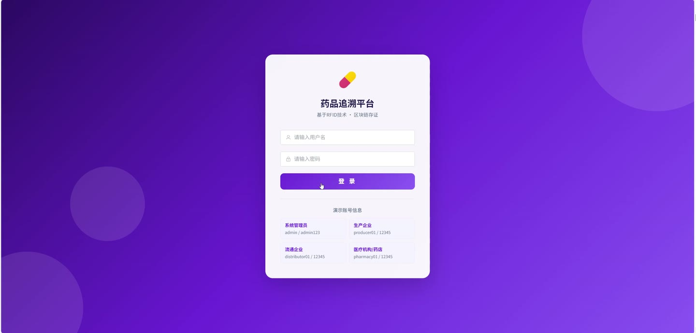
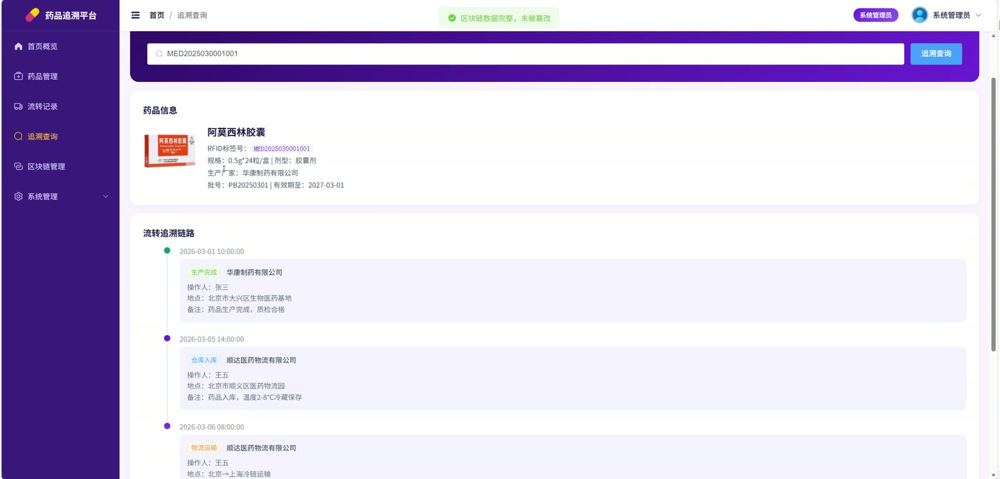
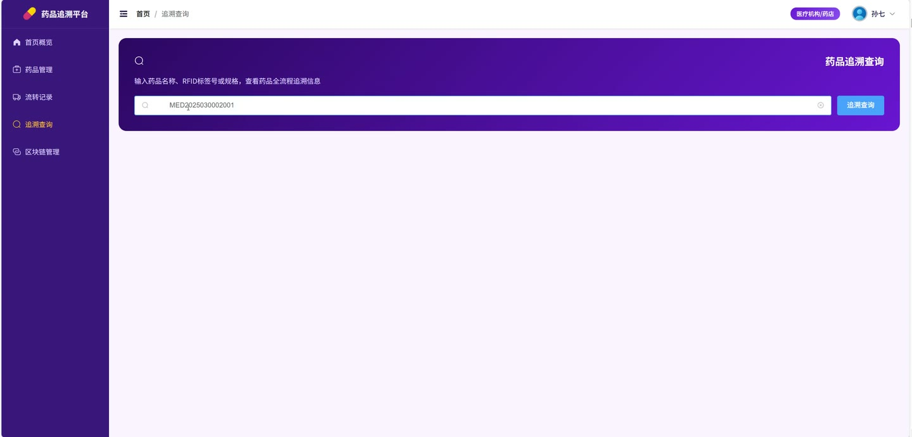
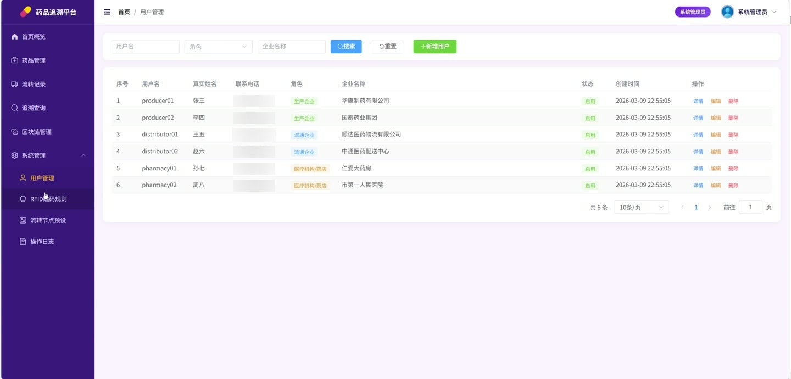
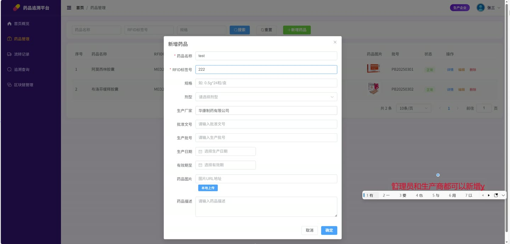
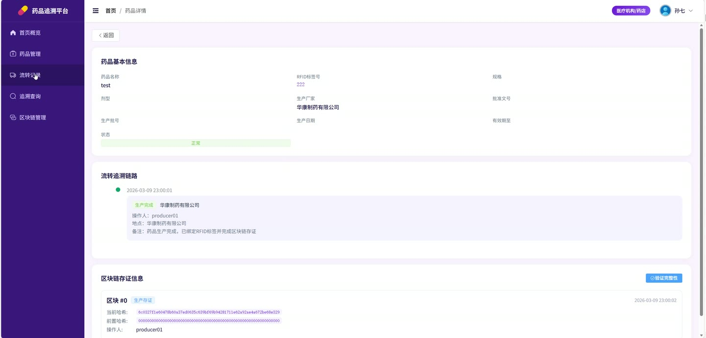

# (附文档)Springboot3+Vue3+MySQL 基于RFID技术的药品追溯平台

**技术栈**：Springboot3、Vue3、MySQL

### 系统简介

基于 Springboot3 + Vue3 + MySQL 的药品追溯平台，采用前后端分离架构。系统通过 RFID 标签为每件药品赋予唯一身份标识，并结合区块链技术记录药品从生产到流通的全链路信息，实现药品来源可查、去向可追、责任可究。平台包含管理员、生产企业两种角色，分别负责系统运营与药品全生命周期管理。
 
### 核心功能
 
### 管理员端

 
- 用户管理：分页查询用户列表（支持按用户名/角色/企业名称筛选），新增/修改/删除用户，设置用户角色与账号状态（启用/禁用） 
- 药品管理：查看所有药品列表（支持按药品名称/RFID标签/规格/生产企业筛选），新增药品时自动完成区块链生产存证并生成首条流转记录 
- 流转记录管理：查看全平台流转记录（支持按药品ID/RFID标签/节点类型/操作人筛选），新增流转记录时自动生成区块链存证 
- 区块链管理：分页查看所有区块数据（支持按药品ID/操作类型筛选），按药品ID查询完整区块链，验证指定药品的区块链数据完整性（哈希链校验） 
- RFID编码规则管理：分页查询编码规则列表（支持按规则名称搜索），新增/修改/删除RFID标签编码规则，配置规则前缀与编码长度 
- 流转节点预设管理：查看所有流转节点（含启用/禁用状态），新增/修改/删除节点预设，设置节点类型、名称、排序顺序与启用状态 
- 操作日志查看：分页查询系统操作日志（支持按用户名/操作类型/执行状态筛选），记录每次操作的请求方法、参数、IP地址与执行耗时 
- 文件上传管理：上传药品图片等附件，系统按日期自动分目录存储，记录文件原始名称、大小、类型与上传人 
- 药品数据统计：查看药品总数、正常药品数、异常药品数等统计指标 
- 个人信息管理：修改个人密码（需验证原密码），查看当前登录用户信息
 
### 生产企业端

 
- 药品管理：查看本企业生产的药品列表（仅可见自身数据），支持按药品名称/RFID标签/规格筛选，新增药品时填写名称、RFID标签、规格、剂型、生产厂家、批准文号、批号、生产日期、有效期等信息 
- RFID标签查询：通过RFID标签号快速检索对应药品详情，支持关键词搜索RFID标签列表用于下拉选择 
- 流转记录管理：查看本企业操作的流转记录（仅可见自身数据），新增流转记录时选择RFID标签、节点类型、节点名称、操作企业、操作地点并填写备注，系统自动关联药品并生成区块链存证 
- 区块链查看：查看本企业药品的区块链数据，按药品ID查询完整区块列表，验证区块链数据是否被篡改 
- 个人信息管理：修改个人密码，查看当前用户信息 
- 药品数据统计：查看本企业药品总数、正常药品数、异常药品数 
- 文件上传：上传药品相关图片或文档附件
 
### 技术栈

  后端框架 Spring Boot 3   ORM MyBatis-Plus   权限认证 JWT（jjwt）   前端框架 Vue 3   状态管理 Pinia   构建工具 Maven   数据库 MySQL   密码加密 SHA-256   文件存储 本地文件系统（按日期分目录） 
 
### 交付内容

 
- 后端完整源码 
- 前端完整源码 
- 数据库初始化脚本 
- 万字文档

## 界面展示

---

## 获取完整源码 + 万字文档

本仓库为项目介绍页。**完整前后端源码、数据库初始化脚本、万字项目文档**，请加微信 `kangkangcode`，或访问 [codekk.top](http://codekk.top) 获取。

可作课程设计 / 毕业设计参考，支持远程部署调试。